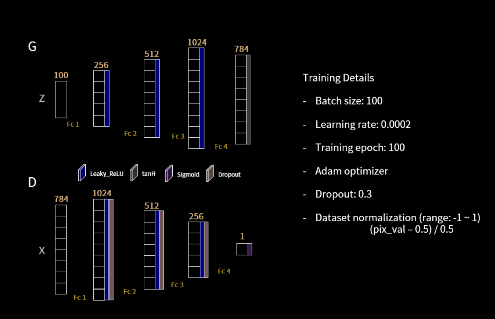
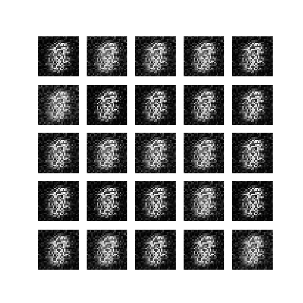
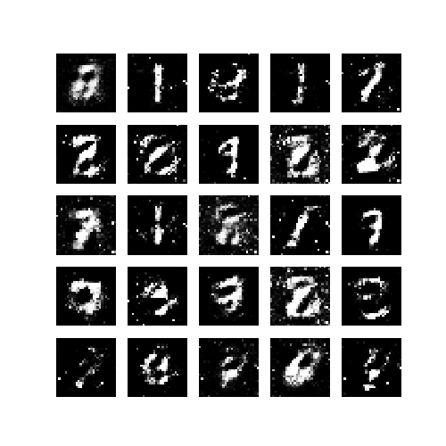
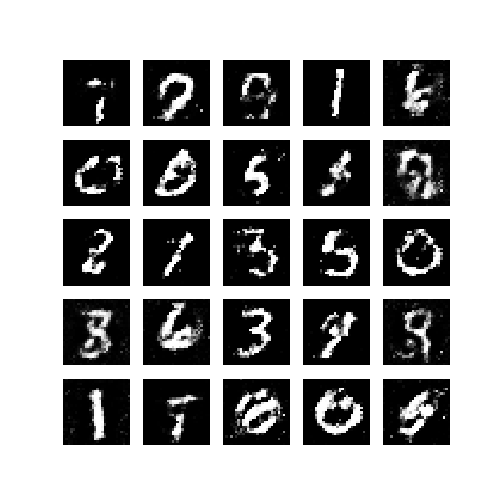
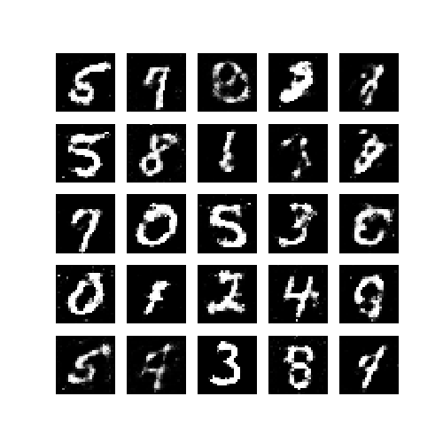
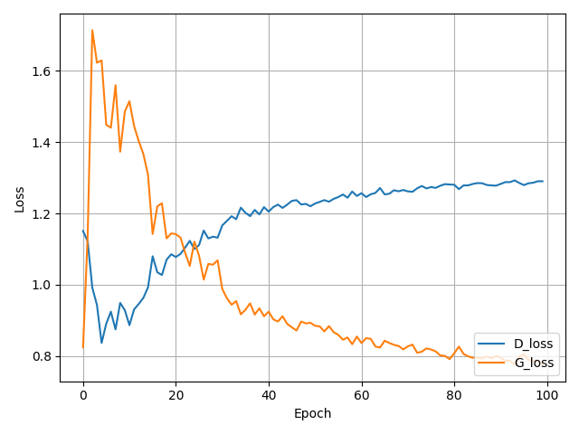

# Unsupervised Learning by Generative Adversarial Nets

## Aim
1. obtain practical knowledge and hands-on understanding of the basic concepts in Generative Adversarial Nets(GAN)
2. obtain practical experience on how to implement basic GAN using tensorflow.

## Understanding GAN models basic concepts

Objective: To become familiar with basic of GAN model and its basic usages.

Reference: https://towardsdatascience.com/understanding-generative-adversarialnetworks-4dafc963f2ef

## Generative Adversarial Networks with TensorFlow
Objective: To become familiar with GAN and re-implement the original GAN model

1. the architecture of discriminator and generator as follow:

2. remove dropout function for this architecture, and observe its training 
convergence.

3. show the generated images at 10 epochs, 20 epochs,50 epochs,100 
epochs

## Report
[A Critical Analysisof ‘Generative Adversarial Nets’](./report.pdf)

## Result
Epoch 10

Epoch 20

Epoch 50

Epoch 100

Train Histograms

